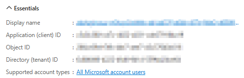
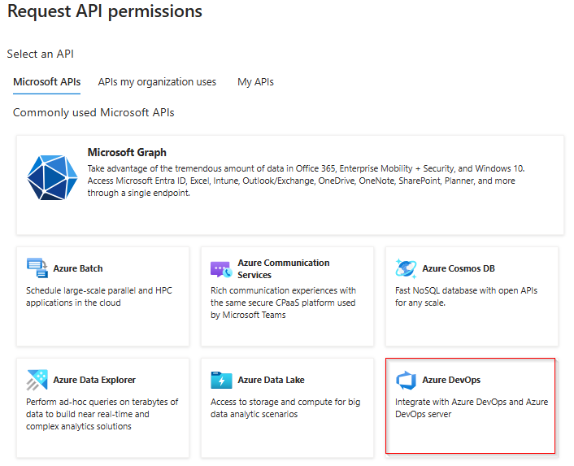

# Azure DevOps Generator Overview

To run the ADOGenerator project as a console application or executable, follow these steps:

- [Clone and Run the application](#clone-and-run-the-application)
- [Authentication](#authentication)
   - [Using a Personal Access Token (PAT)](#using-a-personal-access-token-pat)
   - [Using Device Login](#using-device-login)

# Clone and Run the application

## Prerequisites

Ensure you have the following installed on your machine:
- [.NET 8 SDK](https://dotnet.microsoft.com/download/dotnet/8.0)
- [Visual Studio](https://visualstudio.microsoft.com/) or any other preferred IDE

## Steps

1. **Clone the Repository**
   If you haven't already, clone the repository to your local machine:
   ```sh
   git clone <repository-url>
   cd <repository-directory>
   ```

2. **Open the Solution**
   Open the ADOGenerator.sln solution file in Visual Studio or your preferred IDE.

3. **Set ADOGenerator as the Startup Project**
   In Visual Studio:
   - Right-click on the ADOGenerator project in the Solution Explorer.
   - Select Set as Startup Project.

4. **Build the Solution**
   Build the solution to ensure all dependencies are restored and the project compiles successfully:
   - In Visual Studio, right-click on the solution in the Solution Explorer and select `Build Solution`.
   - Alternatively, you can use the command line:
     ```sh
     dotnet build
     ```

5. **Run the Project**
   To run the project as a console application:
   - In Visual Studio, press `F5` or click on the Start button.
   - Alternatively, you can run the project from the command line:
     ```sh
     dotnet run --project src/ADOGenerator/ADOGenerator.csproj
     ```

6. **Publish the Project**
   To create an executable, publish the project:
   - In Visual Studio, right-click on the ADOGenerator project in the Solution Explorer and select `Publish`.
   - Follow the prompts to configure the publish settings (e.g., target folder, configuration, etc.).
   - Alternatively, you can use the command line:
     ```sh
     dotnet publish src/ADOGenerator/ADOGenerator.csproj -c Release -r win-x64 --self-contained
     ```

7. **Run the Executable**
   Navigate to the publish directory and run the executable:
   ```sh
   cd src/ADOGenerator/bin/Release/net8.0/win-x64/publish
   ./ADOGenerator.exe
   ```

## Additional Notes

- Ensure that any required configuration files (e.g., `appsettings.json`) are present in the output directory.
- If you encounter any issues, check the console output for error messages and resolve any missing dependencies or configuration issues.

By following these steps, you should be able to run the ADOGenerator project as a console application or executable.

# Authentication

There are two ways to authorize the ADOGenerator project:
1. **Using a Personal Access Token (PAT)**:
2. **Using Device Login**:

## Using a Personal Access Token (PAT)

1. **Create a Personal Access Token (PAT)**: [Create a PAT](https://learn.microsoft.com/en-us/azure/devops/pipelines/agents/personal-access-token-agent-registration?view=azure-devops#create-a-personal-access-token-for-agent-registration)
   - Go to your Azure DevOps organization.
   - Click on your profile picture in the top right corner and select "Security".
   - Under "Personal access tokens", click on "New Token".
   - Give your token a name, set the expiration date, and select the following scopes 
   - Click "Create" and copy the generated token.

   **Following are the scopes required.**
      
      | Scope                     | Description                              | 
      |---------------------------|------------------------------------------|
      | vso.agentpools            | Agent Pools (read)                       | 
      | vso.build_execute         | Build (read and execute)                 | 
      | vso.code_full             | Code (full)                              | 
      | vso.dashboards_manage     | Team dashboards (manage)                 | 
      | vso.extension_manage      | Extensions (read and manage)             | 
      | vso.profile               | User profile (read)                      | 
      | vso.project_manage        | Project and team (read, write and manage)| 
      | vso.release_manage        | Release (read, write, execute and manage)| 
      | vso.serviceendpoint_manage| Service Endpoints (read, query and manage)|
      | vso.test_write            | Test management (read and write)         | 
      | vso.variablegroups_write  | Variable Groups (read, create)           | 
      | vso.work_full             | Work items (full)                        | 

## Using Device Login
   
### Register Your Application in Azure AD

1. **Sign in to the Azure Portal**  
   Navigate to [Azure Portal](https://portal.azure.com).

2. **Register a New Application**
   - Go to **Azure Active Directory** > **App registrations** > **New registration**.
   - Enter the following details:
     - **Name**: Enter a meaningful name for your app.
     - **Supported Account Types**: Choose an option based on your needs:
       - Single tenant: Accounts in your organization only.
       - Multi-tenant: Accounts in any organization's directory.
     - **Redirect URI**: This is not required for Device Code Flow but can be added later if needed.
   - Click **Register**.

3. **Copy the Application (Client) ID**
   - After registration, go to the **Overview** section.
   - Copy the **Application (client) ID** and the **Directory (tenant) ID** and save it for later.
    
    

4. **Configure API Permissions**
   - Navigate to **API Permissions** > **Add a permission**.
   - Select **Azure DevOps** or any other API you want to access.

    

   - Choose **Delegated permissions**

5. **Following are the scopes required.**
   
    | Scope                     | Description                              | 
    |---------------------------|------------------------------------------|
    | vso.agentpools            | Agent Pools (read)                       | 
    | vso.build_execute         | Build (read and execute)                 | 
    | vso.code_full             | Code (full)                              | 
    | vso.dashboards_manage     | Team dashboards (manage)                 | 
    | vso.extension_manage      | Extensions (read and manage)             | 
    | vso.profile               | User profile (read)                      | 
    | vso.project_manage        | Project and team (read, write and manage)| 
    | vso.release_manage        | Release (read, write, execute and manage)| 
    | vso.serviceendpoint_manage| Service Endpoints (read, query and manage)|
    | vso.test_write            | Test management (read and write)         | 
    | vso.variablegroups_write  | Variable Groups (read, create)           | 
    | vso.work_full             | Work items (full)                        | 

---

### **2. Configure the App Settings**
1. Open your application’s configuration file (e.g., `appsettings.json`) under AppSettings.
2. Add the following details:
   ```json
   {
     "AppSettings": {
        "...": "...",
       "clientId": "<Your Application (Client) ID>",
       "tenantId": "<Your Directory (Tenant) ID>",
       "scope": "499b84ac-1321-427f-aa17-267ca6975798/.default"
     }
   }
   ```
   Replace placeholders with the actual values from the Azure Portal.

---

### **3. Test the Application**
1. Run your application.
2. The app will display a message instructing the user to go to `https://microsoft.com/devicelogin` and enter the provided device code.
3. After entering the code, users will authenticate, and the app will receive an access token.
